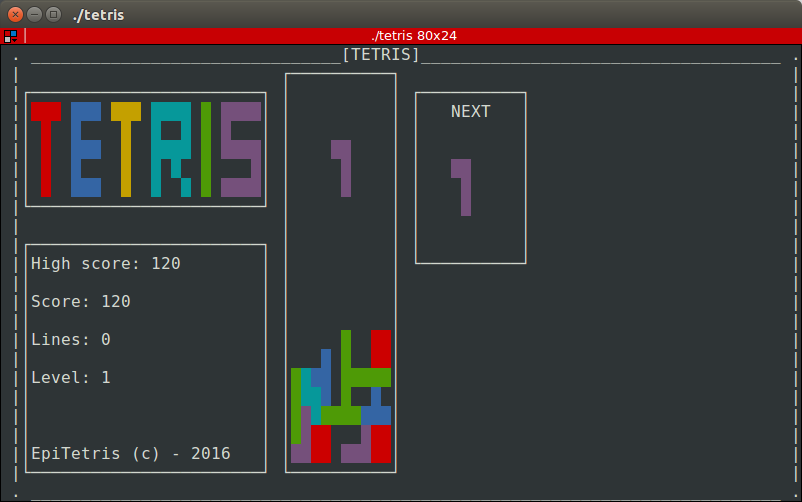

# PSU_2015_tetris
Epitech first year project : [PSU] Tetris

Deadline : 4 weeks

Beginning of the project : 22/02/2016, 07h42

Group size : 2 persons

Contributor : durand_4

# Tetris

Create the Tetris game with the library ncurses.

This tetris is customizable because you can create your own tetromino inside the tetriminos folder.

* [Tetris](https://en.wikipedia.org/wiki/Tetris)

## Getting started

These instructions will allow you to obtain a copy of the operational project on your local machine for development and testing purposes.

### Prerequisites

What do you need to install the software and how to install it?

```
gcc
make
libncurses5-dev
```

### Installation

Here's how to start the project on your computer

Clone and go in the directory PSU_2015_tetris

Project compilation

```
make
```

Running project

```
./tetris
```

## Screenshot



## Build with

* [C](https://en.wikipedia.org/wiki/C_(programming_language))

## Autors

* **David Munoz** - [DavidMunoz-dev](https://github.com/davidmunoz-dev)
